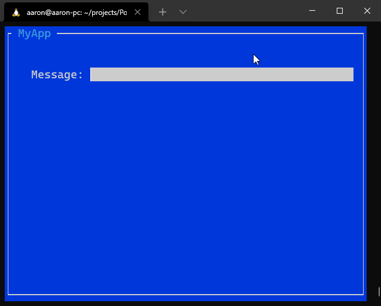

# PocTerminal

# Prerequisite
- You need to have .NET 5 installed on your computer.
- You can check .NET versions on your computer with `dotnet --list-sdks`

# How to run the project locally

- Clone the project to your computer
```sh
$ git clone git@github.com:codesanook/PocTerminal.git
```
- CD to the project folder
```sh
cd PocTerminal
```
- Run the project 

```sh
dotnet run
```
- You should see a window with a text box in your terminal.



- Try to enter some text to a text box and delete it.
- Try again with Thai alphabet and you will find there is a space in each letter and *you can't delete the whole text that you've just entered*.
